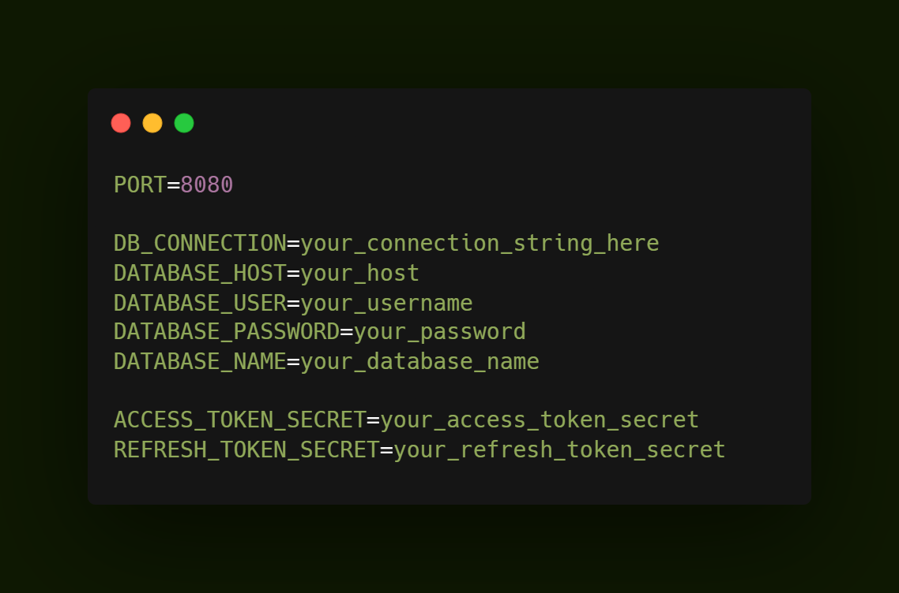
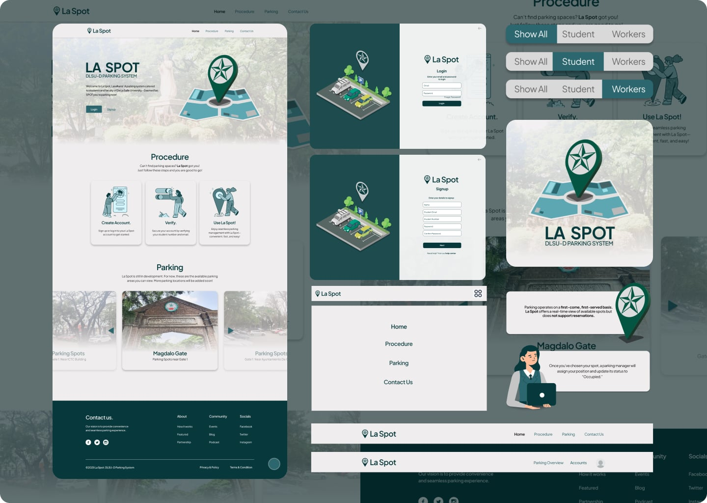
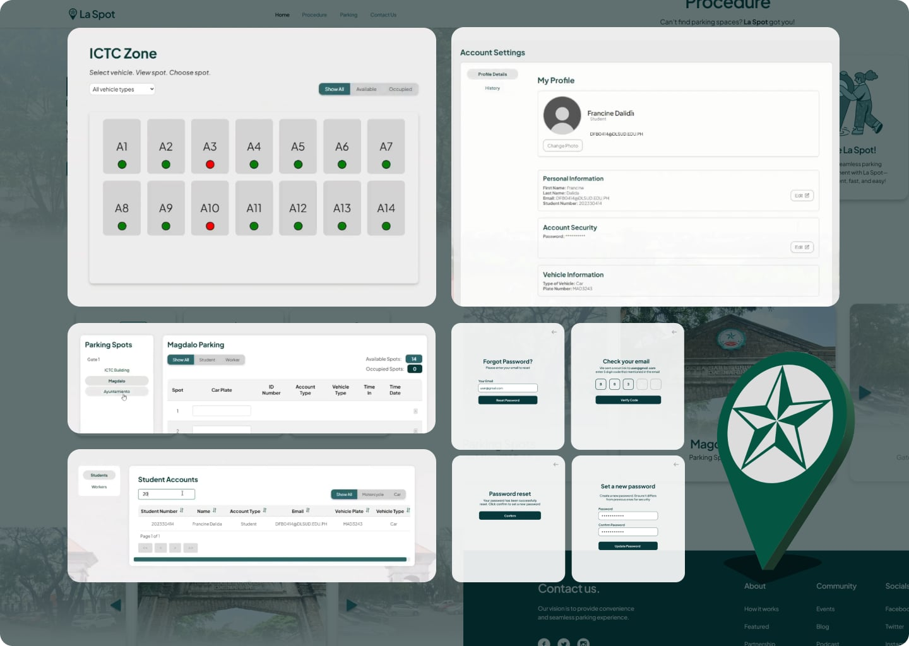
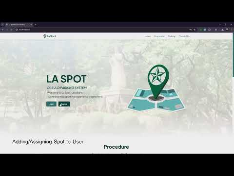

<p align="center">
  
  <br>
  A React-based parking system website powered by modern frontend and backend technologies.<br><br>
</p>

## Tech Stack

Frontend: HTML, CSS, JavaScript, React, Vite  
Backend: MySQL (via MySQL Workbench), NodeJS
<br><br>

## Features

- Responsive Design – Adapts seamlessly to any screen size
- Signup – Supports three account types: Admin, Student, Worker
- Authentication – Login/logout with JWT and role-based authorization
- Password Recovery – Includes email confirmation for password reset
- User Parking View – Overview and specific view of parking zones
- Admin Parking Control – Manage parking lot status (filterable)
- Profile Management – View and update personal account details
- User Parking History – Tabular view of user’s history (paginated and filterable)
- Admin Parking History – Access parking logs of all users (paginated and filterable)
- Account Management – Admin overview of all user accounts (paginated and filterable)
  <br><br>

## Run Locally

Clone the project.

```bash
  git clone https://github.com/KMarttt/La-Spot-Main.git
```

Create a MySQL database using the TableCreation.sql file.

Create a .env in the BackEnd directory using the env-example file as a format.  


Go to the project directory

```bash
  cd La-Spot-Main
```

<br>

### Backend Setup

Create a terminal for BackEnd and go to the BackEnd directory.

```bash
  cd BackEnd
```

Install the required backend dependencies.

```bash
  npm install
```

Start the server.

```bash
  npm start
```

<br>

### Frontend Setup

Create a terminal for FrontEnd and go to the FrontEnd directory.

```bash
  cd FrontEnd
```

Install the required frontend dependencies.

```bash
  npm install
```

Run the application and navigate to http://localhost:3000/.

```bash
  npm run dev
```

<br><br>
**Note**:

- To create an Admin account, use one of the available admin codes stored in the database.
- Admins can use the sample data from the database to start assigning vehicles into the parking sports.
  <br><br>

## Documentation



<br>

**Demo Video**  
[](https://www.youtube.com/watch?v=Kud7pHdQtlI)
<br><br>

## Author

**Francine Ysabel Dalida**  
GitHub: [@cinedalida](https://github.com/cinedalida)

**Jan Escander**  
GitHub: [@CrazyCakeee](https://github.com/CrazyCakeee)

**Marti Kier V. Trance**  
GitHub: [@KMarttt](https://github.com/KMarttt)

**Ojji Villamar**  
GitHub: [@pluckky](https://github.com/pluckky)
